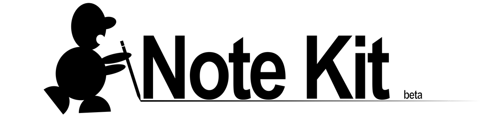

<div align="center">



</div>

# Note Kit

Note-kit helps organize your notes, and keeps track of information while working with AI on larger projects. Based around a tight user response loop, the kit helps you focus on what's important, keeping details in place without re-treading the same ground. It installs into an Obsidian vault and pairs with Claude Code- everything it touches is plain markdown in folders you own, portable, and useful in any other LLM memory ecosystem.

Throughout this document, tokens like `<inbox>` and `<projects>` appear — these are defined in `CONFIG.md` along with all user-facing configurations. 

> [!WARNING]
> **Note-Kit is in development and does not work perfectly. Stay tuned for developments.**

---

## Contents

- [Why use this kit?](#why-use-this-kit)
- [What you get](#what-you-get)
- [User experience](#user-experience)
- [Before you install](#before-you-install)
- [Install](#install)
- [First session — fit the kit to you](#first-session--fit-the-kit-to-you)
- [The life of an idea](#the-life-of-an-idea)
- [Day to day](#day-to-day)
- [The folder system](#the-folder-system--para-by-default-yours-by-config)
- [How to configure your note kit](#how-to-configure-your-note-kit)
- [Format notes — the shape of each type](#format-notes--the-shape-of-each-type)
- [What the agents do](#what-the-agents-do)
- [Syncing your vault between machines](#syncing-your-vault-between-machines)
- [Third-party plugins that pair well](#third-party-plugins-that-pair-well)
- [Upgrading](#upgrading)
- [Troubleshooting](#troubleshooting)
- [Reset or uninstall](#reset-or-uninstall)

---

## Why use this kit?

AI output tends to be chaotic, and prone to contradiction over time. Many tools that aim to alleviate this issue end up contributing to it, degrading content by canonizing bad information, and self-repairing on that false premise. This causes burnout in people, and token waste with LLMs. 

**Note-kit can help.** By placing all output behind structured human review gates, and managing the organizational backend automatically, the user is freed to focus on what matters.

**The kit builds on existing knowledge, instead of re-inventing everything every time.**

---

## What you get

- **A review gate.** Every draft lands in `<inbox>` with `reviewed: false`. The user reviews the human-facing document, and if approved, the content and its children are staged for processing by the scheduled agents.
- **Skills** — nine Claude skills that produce structured work, each introduced at its step in the loop below.
- **Four scheduled agents** that maintain the vault automatically.
- **Semantic search** over the vault, served by a small local daemon the assistant queries through MCP.
- **An Obsidian UI plugin** (`note-kit-ui`) and a matching **`Note-Kit` theme**, built together to cut information noise and make the vault navigable at a glance: a colored dot per `type`, structural prefixes hidden from display names, explorer rows weighted and faded by folder so the ones that matter stand out, an unreviewed flag (with a live "N unreviewed" count on the inbox), and a one-click **"For You"** page (the sun icon) that surfaces only your queues, drafts, and active projects. The plugin reads the kit's own `CONFIG.md`, so its labels never drift from your setup, and it takes its colors from the theme. Everything stays plain markdown underneath, and it runs on mobile over Obsidian Sync or git.

---

## User experience

Note-kit is just plain markdown files in a normal folder tree on your disk. Two apps open that folder for different jobs:

- **Obsidian is your review window:** the calm surface you check on your own cadence (every hour, once a day, whenever) to read what's waiting and approve it. You don't run the AI assistant from inside Obsidian.
- **Claude Code does the work, against the vault folder itself.** Open that folder as the project (the Desktop app, the CLI, or the VS Code extension) and the AI assistant edits the files directly. It is the same folder Obsidian has open, worked by both.

**You steer the kit by setting values in your notes.** Approving a draft is flipping `reviewed: true`; answering the kit is ticking a checkbox in a queue; handing it work is dropping a file in `<outbox>`. That is the whole control surface. Asking the AI assistant in a live session to set a value works too, at one step more than changing it yourself.

> [!WARNING]
> You can operate note-kit outside the Obsidian UI — the files are plain markdown and the agents still run. Without the plugin and theme, though, you navigate the vault as raw folders and frontmatter, which is much harder.

---

## Before you install

**You need three programs.** Each is a normal download-and-install:

1. **Python 3.9 or newer** (python.org) — runs the kit's scripts. **Windows users:** on the installer's first screen, tick **"Add python.exe to PATH"** before clicking Install. Without it, the commands below won't be found.
2. **Obsidian** (obsidian.md) — the notes app. Free. Name and set up an empty vault location, and copy the path.
3. **Claude Code desktop app** (claude.com/claude-code) — the AI assistant. **How you run it for interactive work is your choice:** the Desktop app, the CLI, and the VS Code extension all open the vault and drive the kit the same way. **Scheduling is the exception.** Running the four agents automatically on a clock needs the **Desktop app**, the only runtime that registers routines today; spawning agents from the terminal on a schedule is possible but unconfigured in this kit. **The kit does not run on the Claude web app,** which cannot reach your files. The skills and agents may also run on local non-Claude platforms (Codex, Ollama, and the like), though those are untested and unconfigured.

**The install uses a terminal** — the text window where you type commands. To open one:

- **Windows:** click Start, type **PowerShell**, press Enter.
- **macOS:** press **Cmd+Space**, type **Terminal**, press Enter.
- **Linux:** open your distribution's terminal application.

Move into a folder: `cd <path>` (for example `cd C:\Users\you\Downloads\note-kit`). Once the terminal is active here, everything else is copy-paste.

**The install works across two different folders:**

- the **kit folder** — where you downloaded note-kit (for example `C:\Users\you\Downloads\note-kit`). The installer runs *from* here, once.
- the **vault folder** — where your notes live or will live (for example `C:\Users\you\Documents\MyVault`). The kit installs *into* here, and this is the folder you'll open in Obsidian and Claude Code from then on.

> [!IMPORTANT]
> If you already keep notes in an Obsidian vault, point the install at that vault — your existing notes stay where they are; the kit adds its folders and files alongside them. **Back up an existing vault first** (copy the folder somewhere safe): the agents enforce the kit's conventions once they run, and a backup makes the decision reversible.

---

## Install

1. **Download the kit** from [github.com/JJ-9000/note-kit](https://github.com/JJ-9000/note-kit) (Code → Download ZIP) and unzip it — or `git clone https://github.com/JJ-9000/note-kit.git`. Open a terminal and move into the kit folder:

   ```
   cd <path-to>\note-kit
   ```

2. **Scaffold the vault.** Still in the kit folder, run:

   ```
   python .claude/scripts/scaffold_vault.py --path <path-to-your-vault> --with-ui-plugin plugin/note-kit-ui
   ```

   This creates the folder structure (the real folders behind the tokens), copies the kit into `<vault>/.claude/`, seeds both queues with worked examples, installs the Obsidian UI (the `note-kit-ui` plugin and the `Note-Kit` theme), and writes the config files:

   - **Hooks and `settings.json`** — wires three hooks: the always-on rules re-injected on a cadence, a vault briefing at session start, and a config re-sync after any `CONFIG.md` edit.
   - **`.mcp.json`** — registers the vault-search daemon as the `vault` MCP tool. Approve the tool when Claude Code prompts on first launch.
   - **`settings.local.json`** — holds machine-local permission grants and appears as you approve tools; don't sync or share it between machines.

   You can omit `--with-ui-plugin plugin/note-kit-ui` for a headless install, but the UI is how you'll actually read the vault.

3. **Move to your vault folder.** The remaining steps run from the vault, not the kit folder:

   ```
   cd <path-to-your-vault>
   ```

4. **The search daemon.** Run the one-time installer:

   ```
   python .claude/vault-search/install_daemon.py
   ```

   This builds a **private Python environment** (a `.venv` folder: a self-contained copy of the libraries the search daemon needs, kept apart from everything else on your machine; large and machine-specific, which is why it stays out of sync). The build downloads its libraries, so it takes a few minutes on the first run.

   **Semantic search is automatic:** the daemon starts on demand when a Claude Code session opens in the vault, and shuts down on its own when idle. Its first start downloads a small embedding model (~90 MB) and builds the search index, so the first session after install needs internet and takes a minute or two. For an always-on daemon instead, the included Windows-service script (`.claude/vault-search/install-service.ps1`) registers it as a system service; on macOS and Linux, wrap the same start command in launchd or systemd.

5. **The scheduled agents.** The four agents ship as folders under `<vault>/.claude/scheduled-tasks/`. Running them on a local schedule requires the **Claude Code Desktop app**. Register each agent skill as a scheduled routine either via chat or in the *Routines* UI in the side panel. Set your preferred model, cadence, and permissions (**Bypass Permissions** or **Auto Mode**, you may need to allow this feature in the claude code settings so the agents don't stall).

   **Permissions matter more than they look.** A scheduled run cannot answer a permission prompt: it freezes on the dialog, and because each routine runs one session at a time, the frozen session also silently blocks every later scheduled run of that agent until someone notices. If you don't use Bypass/Auto Mode, grant the tools the agents use up front in `<vault>/.claude/settings.local.json` — the filing agent moves notes with a copy → verify → delete sequence, so at minimum:

   ```json
   "permissions": {
     "allow": [
       "Bash(cp:*)", "Bash(cmp:*)", "Bash(mv:*)", "Bash(rm:*)", "Bash(rmdir:*)"
     ]
   }
   ```

   Tighter grants work too (run each agent once interactively and always-allow what it asks for) — the rule is simply that an unattended agent must never be able to hit a prompt.

   What each agent touches:

   - **janitor-agent** — reads the whole vault; writes frontmatter and filename fixes; runs `audit.py`
   - **filing-agent** — reads `<inbox>` and the destinations; moves approved drafts to their homes
   - **action-agent** — reads both queues and `<outbox>`; executes approved items and routes drops
   - **analyst-agent** — reads the whole vault; writes only to `<inbox>` and the logs

   None of them need network or credential access.

6. **The UI — plugin and theme.** The `--with-ui-plugin` flag in step 2 installs both, and you want both: the plugin into `.obsidian/plugins/note-kit-ui/` (enabled in `community-plugins.json`) and the `Note-Kit` theme into `.obsidian/themes/Note-Kit/` (selected in `appearance.json`). Together they are how you read the vault: type colors, hidden prefixes, review flags, and the For You page. To add them to an existing vault by hand: copy `main.js`, `manifest.json`, and `styles.css` from `plugin/note-kit-ui/` into `<vault>/.obsidian/plugins/note-kit-ui/` and enable **Note-Kit UI** under Community plugins; copy `theme/Note-Kit/` into `<vault>/.obsidian/themes/Note-Kit/` and pick **Note-Kit** under Appearance. The plugin takes its colors from the theme, and a true-black **AMOLED** variant is available through the **Style Settings** plugin. The automation runs without them, but the vault is far harder to navigate as raw folders and frontmatter.

---

## First session — fit the kit to you

> [!IMPORTANT]
> **Open Claude Code in your vault root — not the note-kit folder.** Set your vault directory as the project when you launch Claude Code (desktop app: *New Project → Open Folder*; CLI: `claude` from inside the vault). This loads `CLAUDE.md`, the hooks, `.mcp.json`, and all the skills. Every session from here on opens there. Opening anywhere else means none of those fire.

Run one setup session before any real work. Open Claude Code in the vault root and paste this:

> Read README.md and .claude/CONFIG.md and ask a few questions to help the user set up their note-kit:
>
> 1. **Your terminology.** What do you call your projects, reference notes, daily notes, and archive? What markdown tags do you already use? Map my answers onto the CONFIG folder and type defaults, and propose renames only where my vocabulary differs. Explain the default definitions if the user is confused.
> 2. **Your workflows.** How do you capture ideas, what does your typical working session produce, and what should happen to finished work? Tell me where each answer lands in the kit's loop. Explain the agent and skill definitions to the user if they are confused.
> 3. **Your existing tools.** List your installed skills, agents, and hooks, explain what each one is for, and flag anything that overlaps a kit skill, bypasses the review gate, or moves files the agents manage.
>
> Close by proposing a tight set of changes to the default CONFIG. Suggest using the default tools and skills if existing methods are similar. Apply approved changes to CONFIG.md, then run the config sync script.

**Set the folders and types to your preference.** The defaults are the tested path, keep whatever you don't already have a name for. When you make changes (resources living in a `Wiki`, a daily-notes folder, your own tag scheme), edit `CONFIG.md` § Folders and § Types in `<vault>/.claude/`, then run the sync script (`python .claude/scripts/sync_config.py --vault-root <vault>`). That single file is the source of truth; agents, skills, scripts, and the plugin all follow it. Other agents and skills sync wildcard tokens from the config, so in-line edits will be replaced by the definitions in this document.

**Check the skills, agents, and hooks you already have.** A working Claude Code setup accumulates personal slash commands, sub-agents, and hooks, and most coexist with the kit untouched — the kit only asks that AI output land in `<inbox>` as a draft. Three patterns are worth catching before they bite:

- **Overlap** — a personal skill that does a kit job (your own research or session-log command). Pick one owner per job, or the two produce rival artifacts.
- **Contradiction** — anything that writes finished notes straight into your permanent folders, skipping the review gate, or that edits frontmatter the janitor manages.
- **Breakage** — anything that renames or moves vault files on its own schedule; it races the filing agent.


---

## The life of an idea

One loop runs through everything, from idea to archive:

1. **Capture.** An idea lands — a note in `<outbox>`, a line in chat, a journal entry. Raw material becomes vault-ready here: `/note-kit-transcription` cleans up a voice note or meeting dump, `/note-kit-youtube-to-note` turns a lecture link into a cited note, and `/note-kit-processor` imports or atomizes material that already exists (a book, a foreign note collection).
2. **Research,** `/note-kit-research` turns user queries related to that idea into a cited, adversarially-checked research document.
3. **Plan.** `/note-kit-plan` turns research findings and user criticism into one canonical plan that is updated and persists across sessions.
4. **Work.** AI chat sessions (interactive) and sub-agents (automatic) execute the plan. Each session ends with `/note-kit-handoff`, which writes the session log and pulls out any notes the work earned.
5. **Sharpen.** Where the output warrants it, `/note-kit-red-vs-blue` runs an adversarial red-team/blue-team revision pass that mutates a clean control, poisoning it with open issues, blind spots, and user notes. It then fixes what it breaks and records the outcome, diffed against a manifest of the planted issues and an un-mutated control. Applied where it earns its cost, not everywhere.
6. **Machine review.** `/note-kit-review` runs a staged revision pass with a fresh-reader audit before anything reaches you; where a document leans on factual claims, `/note-kit-verify-claims` traces each one to a primary source and carries the verdict inline.
7. **Your approval.** Multi-file work deposits in a parent folder in the `<inbox>` and names one **gate file** — the document you actually read, opening with a decision header of at most five lines. Approving the gate sets `reviewed: true` and auto-approves its supporting set.
8. **Filing.** The filing agent moves approved work to its home; the **janitor** keeps names and metadata correct.
9. **Maintenance and closure.** The analyst watches for drift, splits, and idle projects; finished work goes `complete` and eventually ages into `<archive>`, then `<history>`.

You appear in this loop briefly — at the start with the idea, at the review gate with the decision, and wherever you choose to work in between. Questions and clarification needed by scheduled agents and automatic skills are raised to a user queue for quick management.


---

## Day to day

These surfaces are yours. Everything else runs on its own.

**Drop things in `<outbox>`.** This is the AI agent's intake: a voice note to clean up, a URL to capture, a brief for a skill, a checklist of tasks in the queue. The **action agent** reads every drop and routes it — and it respects what you declared, never summarized into something else. Results come back to `<inbox>` for your review.

**Answer the `<user-queue>`.** When an agent needs your judgment (a structural change, a clarifying question a skill couldn't proceed without), it writes a plain-language query item to the check-box **user queue** in the `<inbox>`. You check the box; the action agent does the rest on its next pass.

**Approve gate files.** Reviewing a working set means reading one document. Its first five lines tell you what the set adds, what deserves a real read, and what your approval triggers. Flip `reviewed: true` and the agents take it from there.

The `note-kit-ui` **For You** pane surfaces exactly these three: the two queues as live checklists, and your unreviewed drafts grouped by type — plus your active projects.

One more surface is quietly yours: **the vault root.** A file sitting loose at the root is your scratch space — never typed, normalized, auto-filed, or flagged. Draft there freely; nothing touches it.


---
## The folder system — PARA by default, yours by config

The kit's default folders follow **PARA**, a widely used organizing method: **P**rojects (active work with an end), **A**reas (ongoing roles and systems you maintain), **R**esources (always true reference knowledge), and **A**rchive (finished or dormant material). The kit adds an `<inbox>` and `<outbox>` in front as the human and machine gates, and a `<snippets>` root for ready-to-paste code. That's the whole tree: seven roots, everything else grows underneath on demand.


---

## How to configure your note kit

None of the note kit's definitions are hardcoded. `CONFIG.md` § Folders maps each token to its on-disk name, and everything downstream — agents, skills, scripts, even the Obsidian plugin — reads that mapping rather than the literal names. Which means the kit bends to an ecosystem you already have:

- **Rename anything.** Already keep resources in a folder called `Wiki` or `Garden`? Change the `<reference>` row's literal in CONFIG, run the sync script, and every agent follows. A karpathy-style flat wiki is just `<reference>` with one level of domains.
- **Add a type.** New note type (say, `recipe`)? Add a row to CONFIG § Types with its naming pattern and default home; give it a `Format-Recipe` note if you want the agents checking its shape.
- **Remove what you don't use.** A type with no files costs nothing; leave the row or delete it. The agents act on what exists.
- **Bring your repos.** A git repo, a dataset, an export — anything matching CONFIG § Asset folders (a `.git` inside, a `-repo` suffix, a `.keep-whole` marker file) is treated as one opaque object: moved whole, never reorganized, never touched inside. Your code stays exactly as your tools expect it.
- **Keep your daily-notes habit.** A dated journal flows through as `type: journal` — the kit files it, it never rewrites it.

The rule of thumb: change the *mapping* in CONFIG, never fight the agents folder-by-folder — **they enforce whatever CONFIG says, so CONFIG is where you edit.**

---

## Format notes — the shape of each type

Every note type ships with a `Format-<Type>` note (`Format-Session`, `Format-Plan`, `Format-Gate`, …), seeded into the areas format folder at install. Each one holds the type's frontmatter block and body skeleton: producers consult it before authoring a typed note, and the analyst checks filed notes against it for drift. They are yours to edit — reshape one and every future note of that type follows. Adding a type? Give it a `Format-<NewType>` note and the agents check its shape too.

---

## What the agents do

| Agent         | Cadence | One line                                                                                           |
| ------------- | ------- | -------------------------------------------------------------------------------------------------- |
| janitor-agent | daily   | per-file hygiene: names, frontmatter, inference the scripts couldn't resolve                       |
| filing-agent  | daily   | moves `reviewed: true` drafts from `<inbox>` to their homes, checking each fits in its destination |
| analyst-agent | weekly  | the wide view: proposes splits, indexes, consolidation; flags repeated corrections                 |
| action-agent  | hourly  | executes approved queue items and routes every `<outbox>` drop                                     |

---

## Syncing your vault between machines

Your vault is a plain folder; sync it with **Obsidian Sync** or **git** — both carry exactly what they should and nothing else. Three paths are machine-local and rebuild themselves — **keep them out** of whatever sync you use:

- `.claude/vault-search/.venv/` — the search daemon's private Python environment. Large, full of binaries built for one specific machine; copying it to another breaks silently. Each machine builds its own by running the step-4 installer once.
- `.claude/vault-search/data/` — the search index. Rebuilds automatically on each machine.
- `.claude/settings.local.json` — your per-machine permission grants.

How each option behaves with the kit:

- **Obsidian Sync** carries your notes and, optionally, your Obsidian settings and plugins — but not hidden folders like `.claude/`, so the machine-local paths exclude themselves and so does the kit. Notes flow between machines; run the install once on each machine that runs the agents or the daemon.
- **git** syncs exactly what you commit. This is `.gitignore` at the vault root:

  ```gitignore
  .claude/vault-search/.venv/
  .claude/vault-search/data/
  .claude/settings.local.json
  ```

  Git doubles as a backup: `git init` in the vault, commit when you like, push to a private repository, and every note keeps its full history. **Remember to anonymize content before publishing**.

> [!WARNING]
> A general folder-sync service (iCloud, Dropbox, OneDrive) is not recommended for the vault: most can't exclude the machine-local paths (the synced `.venv` arrives broken on the other machine), and the ones that offload files to placeholders (iCloud's "Optimize Storage", OneDrive's "Files On-Demand") leave stubs the daemon and agents can't read. If your vault already lives in such a folder, keep it set to stay fully on disk, exclude the three paths where the service allows it (Dropbox's selective sync), and re-run the step-4 installer on each machine.

Remember: **register the scheduled agents on only one machine.** Two machines running the same agents race each other over the same files, and the sync service turns the collisions into conflict copies. The daemon needs no such care — each machine runs its own, against its own index.

---

## Third-party plugins that pair well

The kit is complete without community plugins — `note-kit-ui` already shows types, folder covers, and review flags. These add something the kit doesn't do, and each is optional:

- **Obsidian Git** — commits and pushes the vault from inside Obsidian on a schedule. The natural companion to the git sync setup above.
- **Dataview**, or the core **Bases** feature — dashboards over the kit's frontmatter: every `status: active` project, drafts waiting on review, notes by type.
- **QuickAdd** — one-keystroke capture into `<outbox>`; the action agent routes it from there.
- **Advanced URI**, and **Actions for Obsidian** on iOS — capture from your phone via share sheet or Shortcuts. Point captures at `<outbox>` and the loop takes over.
- **MCP servers for Obsidian** — community servers (most ride on the Local REST API plugin) that let AI tools drive the Obsidian app itself. The kit needs none: Claude Code edits vault files directly and ships its own `vault` MCP for semantic search. What one adds is app control — opening notes, arranging the workspace. If you run one, include it in the first-session audit like any other pre-existing tool.
- **Style Settings** — exposes the `Note-Kit` theme's options, including the AMOLED true-black toggle. Optional; the theme is complete without it.

Two cautions. A plugin that stamps or rewrites frontmatter (Templater used on `type`/`tags`/`date`) overlaps the janitor, which repairs those fields itself — keep templates to note bodies. And a replacement file explorer (Notebook Navigator and kin) swaps out the pane `note-kit-ui` decorates, so the type dots and review flags disappear with it. Anything that writes frontmatter or moves files belongs in the first-session audit.

---

## Upgrading

To move an installed vault to a newer kit version, download the new kit and run the scaffold from it with `--upgrade`:

```
cd <path-to-new>\note-kit
python .claude/scripts/scaffold_vault.py --upgrade <your-vault>
```

This refreshes the kit's *code* — `scripts/`, `skills/`, `scheduled-tasks/`, `hooks/` — and never touches your notes. Two limits: files you own (`CLAUDE.md`, `RULES.md`, your edited `CONFIG.md`) are preserved rather than overwritten, so new config information in the kit's versions are not merged automatically — compare by hand if the release notes flag them. The Desktop app keeps its own copy of each registered agent, so after an upgrade, delete and re-register any agent whose `SKILL.md` changed.

---

## Troubleshooting

If...

- **Skills, hooks, or the `vault` search tool aren't available:** Claude Code is probably open in the wrong folder. The skills, hooks, `CLAUDE.md`, and `.mcp.json` only load when Claude Code is opened with the **vault root** as its project directory — not the note-kit source folder, not a subfolder. Close and reopen with the vault folder selected as the project.
- **`python` is not recognized** (Windows): Python wasn't added to PATH. Re-run the Python installer, choose Modify, and tick "Add python.exe to PATH" — or use `py` instead of `python` in every command.
- **The search daemon won't start, or the `vault` tool errors:** check it with `python .claude/vault-search/daemonctl.py status` from the vault folder. The most common cause is another vault on the same machine already holding port 8765 — change `port:` in `.claude/vault-search/config.yaml`, then update the same number in `.mcp.json` and `.claude/hooks/session-start-context.py`.
- **First search of the day is slow:** that's the on-demand start warming up (and on day one, the ~90 MB model download). After that, queries are quick.
- **An agent run stalls waiting for permission:** open its routine in the Desktop app, run it once interactively, and choose always-allow on the tools it asks for (or grant the file-move family shown in Install step 5). A stalled run does double damage: routines run one session at a time, so the frozen session also blocks every later scheduled run of that agent until it's closed.

---

## Reset or uninstall

Work from the outside in, so nothing is left running against a missing vault:

1. **Stop the search daemon:** `python .claude/vault-search/daemonctl.py stop` from the vault folder, and remove its service entry if you registered one.
2. **Delete the four agents** from your Desktop routines.
3. **Delete the kit's files:** `<vault>/.claude/`, `<vault>/.mcp.json`, and the plugin folder `<vault>/.obsidian/plugins/note-kit-ui/` if you installed it.
4. **Keep or remove the folder scaffolding** (`<inbox>`, `<outbox>`, the project/area/reference/snippet/archive roots) — keep any notes you want; they're plain markdown and belong to you.

Or skip the manual steps: open Claude Code in the vault directory and ask — *"read README.md and uninstall note-kit; archive my notes first."*
